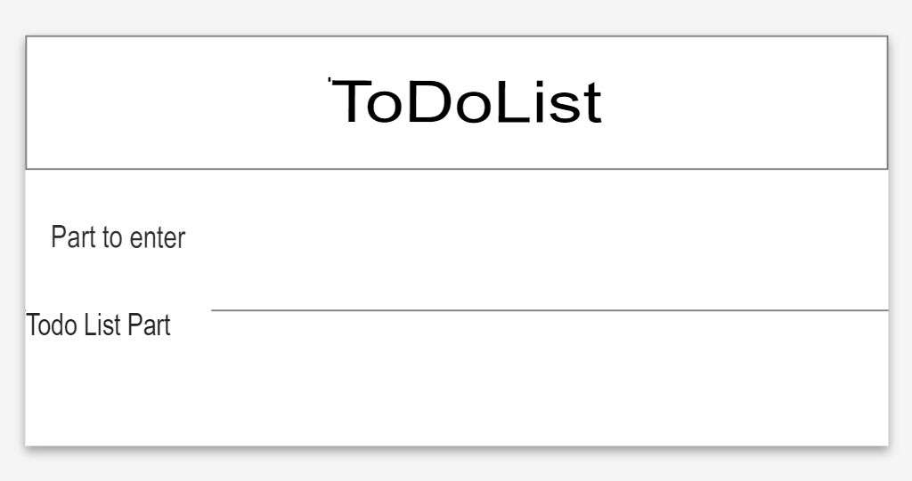

# EXERCISE 00 -Hello React!

|                            |                 |
| -------------------:       | --------------- |
| The folder name to submit: | ex00 |
| File name to submit:       | index.html, app.js, index.js, all the files needed for other reverse projects                                       |
| External module available: |                 |
| Note:                      |                 |

The file name to be submitted can be changed, removed, or added.

If you install the Create-React-App (CRA) and the default Welcome to React page appears well, it's time to create your own template page.

App.js Use JSX to create and return the TODOLIST Template page by using JSX in the internal function app ().

Do not write a regular HTML file, not JSX.

This process is a process of creating a todolist frame that does not need to work.

The todolist template must have a section for the user to enter the TODO, and the section where the input TODO appears as a list.
Use the Section Tag.

