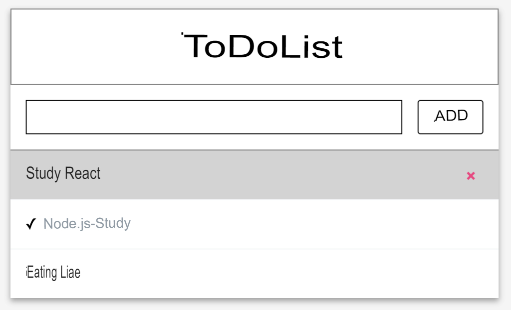

# Exercise 04 - Check와 Remove

|                     |                |
|-------------------: |--------------- |
|The folder name to submit: |ex04 |
|File name to submit: |index.html, app.js, index.js, todolistTemplate.js, todolistTemplate.css, input.js, input.css, items.js, items.css, itemlist.js
|External module available: ||
|Note: ||

The file name to be submitted can be changed, removed, or added.

Now let's implement the function of todolist.

When the user clicks on the item, there is a check mark on the left side of the item and the function of changing the style of item.
When the user clicks on it again, the check mark will disappear, and the function of returning to the original.
If the user clicks on the DELETE button on the item, the item is deleted.

