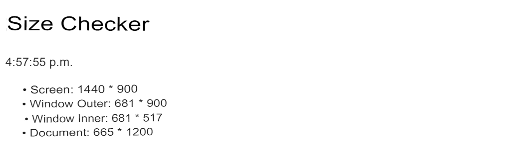

# Exercise 00 - Window Size Checker

| | |
| ----------------------: | ------- |
| Folder name to submit: | ex00 |
| File name to be submitted: | size.js |
| Available external modules: | None |
| Note: | None |

When the page is finished loading, create a page that displays the current time and size. The unit is px.

You must use the provided HTML file. Do not modify, add or delete the contents.

The size is added as a child element of the HTML ul. You must use semantically correct child elements.

The contents below are presented in order. The format is `[content]: [horizontal] * [vertical]`

- screen
- outer of window
- inner of window
- The total size of the document. Includes areas not visible from the current scroll.

Of course, if you refresh the page after changing the window size, the correct time and changed size should appear.

The content of the HTML `time` element is displayed according to local time notation.

The `datatime` attribute of the HTML `time` element is displayed in ISO format.

`querySelector` is not yet available. Try using the tree structure of the DOM as in the example below.

```javascript
document.body.main.time.datetime;
```

The content of the finished page should look similar to this:


Figure 0.1: Screenshot of the finished result. Depending on your regional settings, the time format may vary.