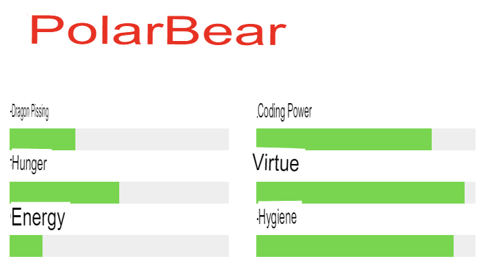
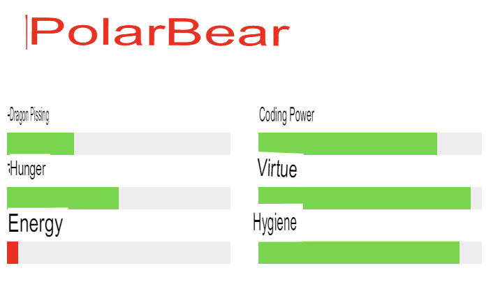
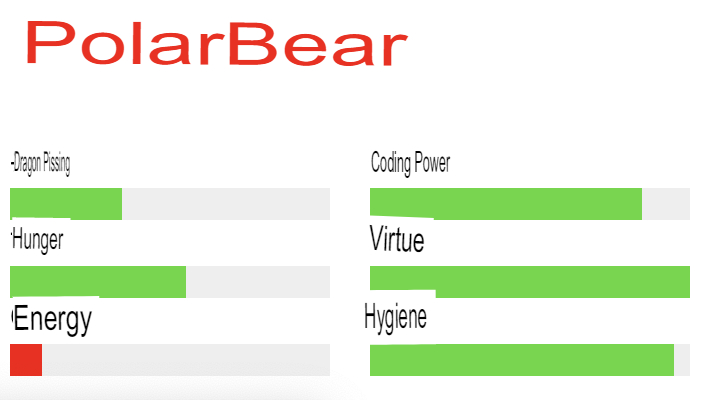

# Exercise 01 - Polar Bear

| | |
| --------------------:| -------------------- |
| Folder name to submit: | ex01 |
| File name to be submitted: | ex01.html, ex01.js |
| Available external modules: | None |
| Note: | ex01.css |

Create a page where the progress bar changes over time. Look at the provided ex01.css and write your HTML and JS.

- The provided ex01.css file cannot be added or deleted, and the HTML must be written manually.
- Do not allow Internal Style Sheets.
- Use External Javascript.
- You can use querySelector.

- After the javascript is loaded,
- Decrease the energy progressbar by 10 and write JS to change the color to red.
- Write JS to make all progressbars increment by 5 after 5 seconds.