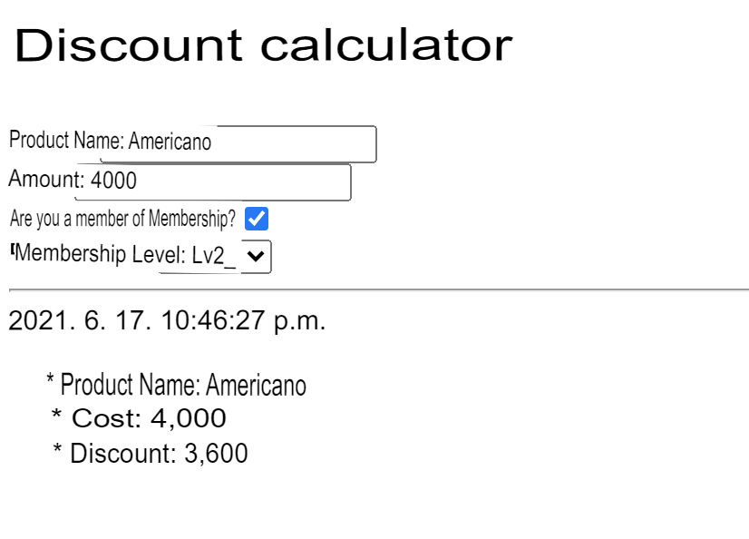

# ex 02 - Discount calculator

| | |
| ----------------------: | ------------------- |
| Folder name to submit: | ex02 |
| File name to be submitted: | index.html, calc.js |
| Available external modules: | None |
| Note: | None |

Create a page that calculates the discount rate based on membership status by entering product information. You must submit an HTML file and a JS file. Use External Javascript.

Pages `title` and `h1` are `Discount calculator`.

The elements to be included in the Form are as follows.

- 'Product Name': text field
- 'Amount': Numeric field
- 'Are you a member?': you must use the checkbox field. If checked, you can select 'Membership Level' right below.
- Membership level: select element. If ‘Are you a member?’ is unchecked, it becomes ‘disabled’. You should be able to select an option. There are three levels, and the discount rate is entered as the value of the `data-percent` attribute of each option element.
  - `--selection--`: the default value before selecting an option
  - `Lv1`: 5% discount
  - `Lv2`: 10% discount
  - `Lv3`: 15% discount

Form's HTML elements must be written semantically. You don't need a submit button.

An `hr` element is placed under the Form.

Below the Form, the contents are displayed like a receipt. The content is updated in real time whenever the Form is modified.

- Time: HTML `time` element. The content is displayed according to local notation and the `datatime` attribute is in ISO format.
- ‘Product Name’: Entered product name
- 'Cost': Entered amount without discount applied. Displays `,` for each unit.
- 'Discount price': Displays the final amount with a discount rate applied according to the membership level selected in 'Cost'. Displays `,` for every thousand units.

Feel free to decorate the style of your form and receipt! However, only Internal Style Sheets are allowed.

Figure 2.1: Screenshot of the finished product. Depending on your regional settings, the time format may vary.

> 💡 https://developer.mozilla.org/ko/docs/Web/JavaScript/Guide/Modules