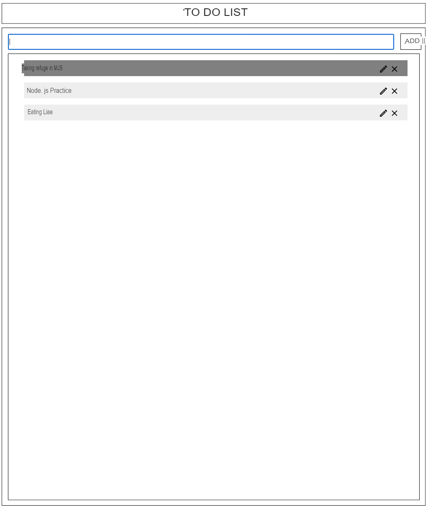

# ex05 - ToDoList

| | |
| --------------------:| -------------------- |
| Folder name to submit: | ex05 |
| File name to be submitted: | ex05.html, ex05.js ex05.css |
| Available external modules: | None |
| Note: | None |

Implement ToDoList with create, check, update and remove functions using HTML, CSS, and JS.

It does not allow Internal Style Sheets.

- The examples are just examples. Customize freely.
- CRUD function is required.
- Change the style of the ToDo item so that the user knows when the mouse hovers over the ToDo. Change the color, change the font or customize it to your liking.
- When ToDo is clicked, it is checked in some way to make it available to the user.
- Implement the ability to delete ToDo.
- Implement the Update function to change the contents of the items in the ToDo list.
- Save the ToDo list to localStorage and make the ToDo list appear again when the window is closed and reopened.
